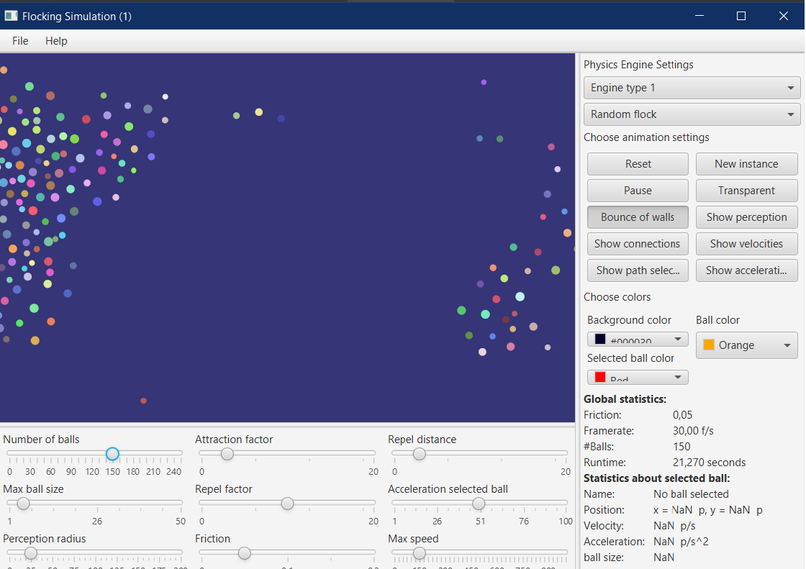
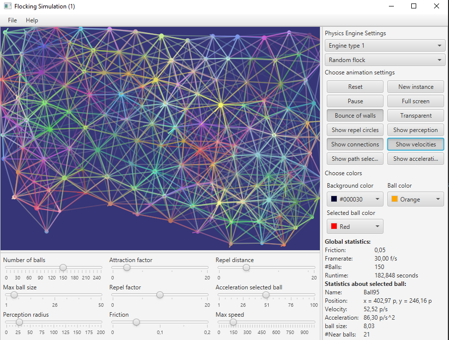
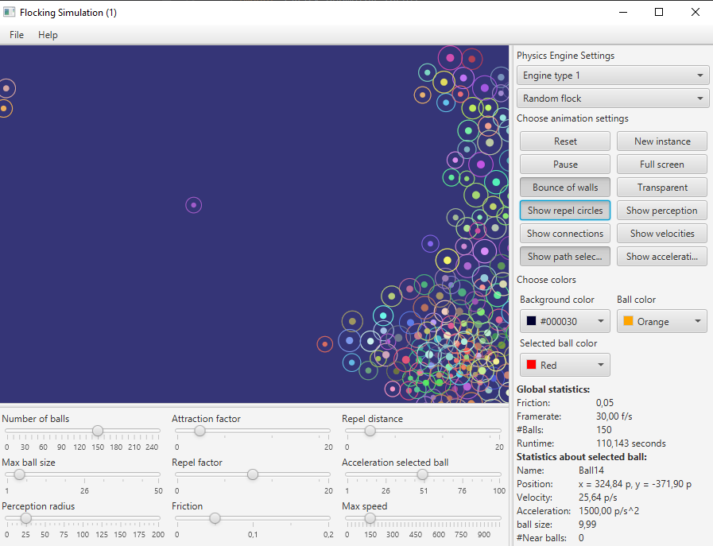
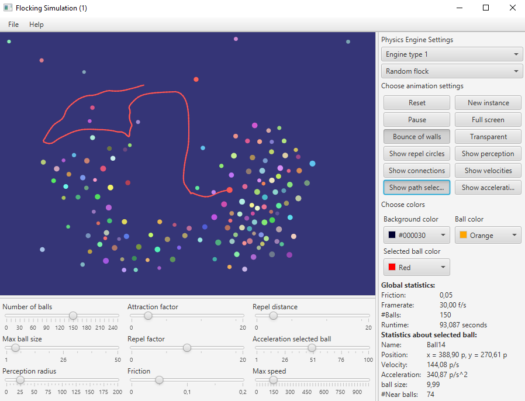
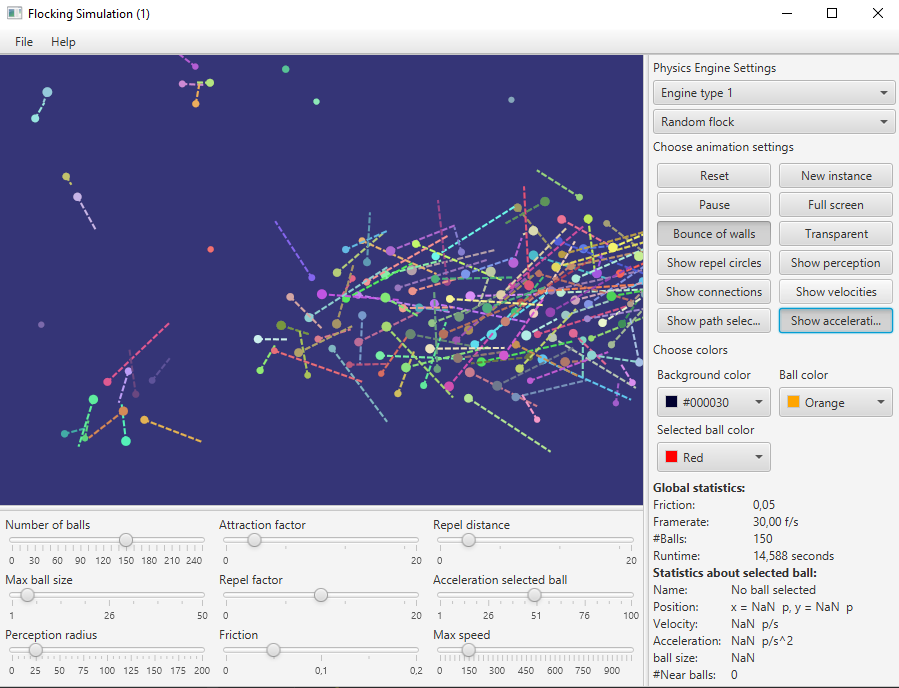
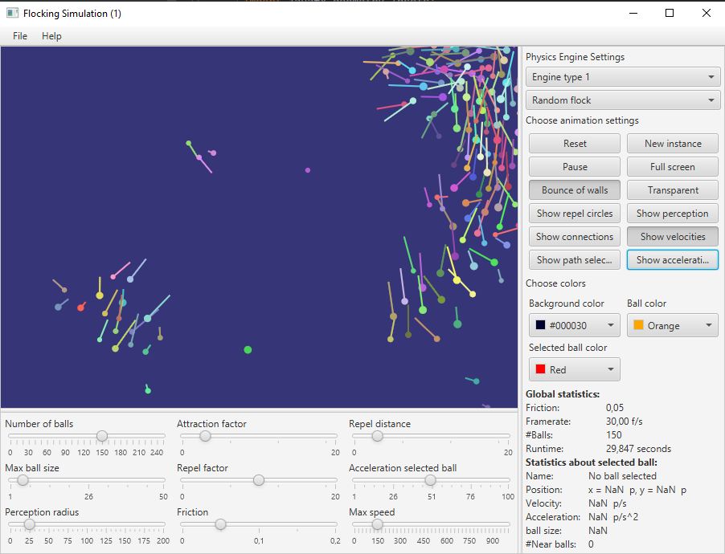
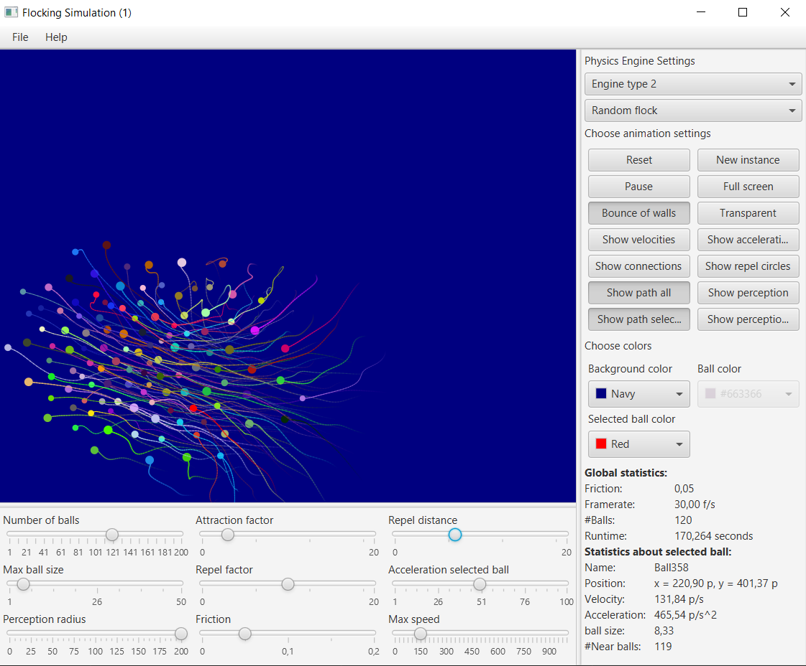

# Flocking Simulation

A program to visualize flocking behaviour of a group of fish or birds

Made By Hans Zuidervaart.

## Setup
Before you run the program, make sure you modify the following in Intellij:
- Go to File -->  Settings --> Appearance and Behaviour --> Path Variables
- Add a new line variable by clicking active the + sign and name it PATH_TO_FX and browse to the lib folder of the JavaFX SDK to set its value, and click apply. 
- Go to Run --> Edit Configurations
- Type the following in the VM Options section: --module-path ${PATH_TO_FX} --add-modules javafx.controls,javafx.fxml
- Click Apply and Run the application. It should work now.
    
source: [JavaFX and IntelliJ IDEA](https://openjfx.io/openjfx-docs/#IDE-Intellij)

## Requirements

## Screenshots

#### screenshot 1: A preview of the application

#### screenshot 2: A preview of when the show connections button is toggled
which boid sees what other boid? This is dependent on the perception radius slider position

#### screenshot 3: A preview of when the show repel circles button is toggled

#### screenshot 4: A preview of when the 'show path selected ball' button is toggled

#### screenshot 5: A preview of when the show accelerations button is toggled

#### screenshot 6: A preview of when the show velocities button is toggled

#### screenshot 7: A preview of when the show paths button is toggled

## Background
Boids is an artificial life program, developed by Craig Reynolds in 1986, which simulates the flockingSim behaviour of birds. His paper on this topic was published in 1987 in the proceedings of the ACM SIGGRAPH conference. [1] The name "boid" corresponds to a shortened version of "bird-oid object", which refers to a bird-like object.[2] Incidentally, "boid" is also a New York Metropolitan dialect pronunciation for "bird".
Rules applied in simple Boids
Separation
Alignment
Cohesion

As with most artificial life simulations, Boids is an example of emergent behavior; that is, the complexity of Boids arises from the interaction of individual agents (the boids, in this case) adhering to a set of simple rules. The rules applied in the simplest Boids world are as follows:

    separation: steer to avoid crowding local flockmates
    alignment: steer towards the average heading of local flockmates
    cohesion: steer to move towards the average position (center of mass) of local flockmates

More complex rules can be added, such as obstacle avoidance and goal seeking.

The basic model has been extended in several different ways since Reynolds proposed it. For instance, Delgado-Mata et al.[3] extended the basic model to incorporate the effects of fear. Olfaction was used to transmit emotion between animals, through pheromones modelled as particles in a free expansion gas. Hartman and Benes[4] introduced a complementary force to the alignment that they call the change of leadership. This steer defines the chance of the boid to become a leader and try to escape.

The movement of Boids can be characterized as either chaotic (splitting groups and wild behaviour) or orderly. Unexpected behaviours, such as splitting flocks and reuniting after avoiding obstacles, can be considered emergent.

The boids framework is often used in computer graphics, providing realistic-looking representations of flocks of birds and other creatures, such as schools of fish or herds of animals. It was for instance used in the 1998 video game Half-Life for the flying bird-like creatures seen at the end of the game on Xen, named "boid" in the game files.

The Boids model can be used for direct control and stabilization of teams of simple Unmanned Ground Vehicles (UGV)[5] or Micro Aerial Vehicles (MAV)[6] in swarm robotics. For stabilization of heterogeneous UAV-UGV teams, the model was adapted for using onboard relative localization by Saska et al.[7]

At the time of proposal, Reynolds' approach represented a giant step forward compared to the traditional techniques used in computer animation for motion pictures. The first animation created with the model was Stanley and Stella in: Breaking the Ice (1987), followed by a feature film debut in Tim Burton's film Batman Returns (1992) with computer generated bat swarms and armies of penguins marching through the streets of Gotham City.[8]

The boids model has been used for other interesting applications. It has been applied to automatically program Internet multi-channel radio stations.[9] It has also been used for visualizing information[10] and for optimization tasks.[11] 
## Motivation
I was curious about the workings of this kind of simulations. It was a lot of fun making it! Enjoy!
## Sources
- [Flocking sim](https://en.wikipedia.org/wiki/Boids)
- [Configuration of Log4j 2](https://logging.apache.org/log4j/log4j-2.7/manual/configuration.html)

